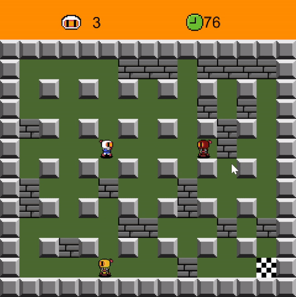

# Demolition Man
This project was created as part of the unit **INFO1113** at the University of Sydney.

## Introduction
In this tiny demo, you could manipulate the character to place the bomb (key : **SHIFT**) or make movements (key: **W, A, S, D**). 
The explosion of the bomb would destroy the blocks or make damage to the players (including the one you are controlling, so be careful as you only have 3 lives :XD). 
## More Details
* This is a **Gradle** project. In order to run it, decompress the resource file( **/src/main/resources.tar.gz** ) and build it with gradle.
## To Sum Up
* Thanks to [ezgif.com](https://ezgif.com/video-to-gif) for helping me generate the gif above. It's totally free!

2021/11, azusaings@gmail.com
